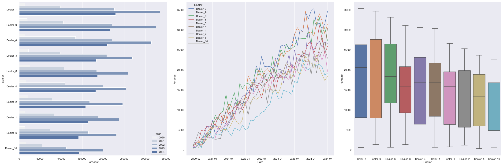

# Formatação 

> Essa é uma citação com **negrito** e *italico*


# Lista
- Não numerada
- Não numerada.
    - próximo item 
        - próximo item

# Lista numerada
1. Primeiro item
2. Segundo item 
3. Terceiro item 

# Incluir link 

[Link](www.google.com)

# Imagem




# Seção 1 {#sec-01}

Referenciar a seção, [clique aqui] {#sec-01}

@sec-01


# Tabela

| ID | Nome |
| -- | -- |
|1 | João |
| 2 | Gui


# Bloco de código

```python

print('Oi')

```


# Linha horizontal

---

Tenho uma formula aqui $ y = ax + b $

$$ y = x ^ 2  \times b $$

$$ \alpha + \omega $$

$$ \sum_{i=1} ^ {10}  \frac{i}{2}$$


